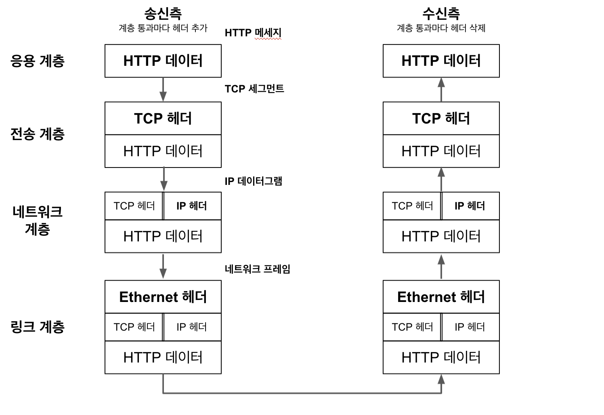
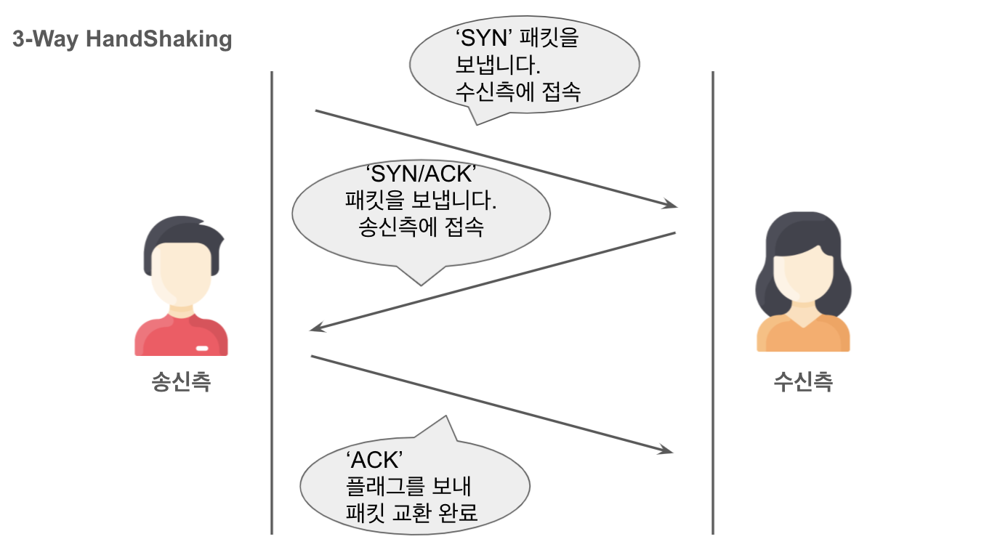
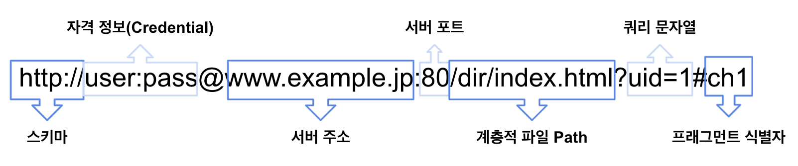

# 1장 - 웹과 네트워크

## **HTTP(HyperText Transfer Protocol)**

- 클라이언트에서 서버까지 일련의 흐름을 결정한다.

 

## **TCP/IP**

 

### 프로토콜의 집합

---

- 프로토콜(Protocol) : 통신을 하기 위한 규칙
  - 케이블 규격
  - IP 주소 지정 방법
  - 상대를 찾는 방법
  - 그 곳에 도달하는 순서
  - 웹을 표시하기 위한 순서
  - ...

TCP/IP는 이러한 인터넷과 관련된 프로토콜들을 모은 것이다.

 

### 계층(Layer)

---

- **응용 계층** (Application Layer)
  - **HTTP**, DNS 등 애플리케이션에서 사용하는 통신의 움직임을 결정한다.
- **전송 계층** (Tranport Layer)
  - 애플리케이션 계층에 네트워크로 접속되어 있는 2대의 컴퓨터 사이의 데이터 흐름을 제공한다.
  - TCP, UDP 등이 있다.
  - 응용 계층에서 받은 데이터(HTTP 메세지) **조각 내어** 통신하기 쉽게 한다.
  - **안내 번호**와 **포트 번호**를 **붙여** 네트워크 계층에 전달한다.
- **네트워크 계층** (Network Layer)
  - 네트워크 상의 **패킷의 이동**을 다룬다.
    - 패킷 : 전송의 최소 단위
  - 상대의 컴퓨터까지 패킷을 보내는 경로를 결정한다.
  - 전송의 경우 **수신지 (MAC 주소)를 추가**하여 링크 계층에 전달한다.
- **링크 계층** (Data Link Layer)
  - 네트워크에 접속하는 **하드웨어적인 면**을 다룬다.

 

### TCP/IP 통신 흐름

 

## **IP/TCP/DNS**

### IP(Internet Protocol)

- 전송 담당
- 네트워크 계층에 해당한다.
- 패킷을 상대방에게 전달한다.
  - IP 주소 : 각 노드에 부여된 주소 | 변경 가능
  - MAC 주소 : 각 네트워크 카드에 할당된 고유의 주소 | 변경 불가능
- **MAC 주소에 의존**해서 통신한다.
  - ARP(Address Resolution Protocol) : 수신지의 **IP 주소를 바탕으로 MAC 주소를 조사**하여 목적지를 찾아가게하는 프로토콜

 

### TCP(Transmission Control Protocol)

- 신뢰성 담당
- 전송 계층에 해당한다.
- 바이트 스트림 서비스를 제공한다.
  - TCP 세그먼트라는 단위 패킷으로 작게 분해하여 관리
  - 용량이 큰 데이터를 보내는데 용이함
- 3-Way Handshaking
  - 상대방에게 확실하게 데이터를 보내기 위한 방법이다.
  - 패킷을 보내고 난 후, 제대로 보내졌는지 여부를 확인한다.
  - 'SYN'와 'ACK'라는 TCP 플래그를 사용한다.

 

### DNS(Domain Name System)

- 응용 계층 시스템에서 도메인 이름과 IP 주소 이름 확인을 제공한다.
- 도메인명에서 IP 주소를 조사할 수 있다.
- IP주소로부터 도메인명을 조사할 수 있다.

 

## URI와 URL

### **URI**

> 리소스를 식별하기 위해 문자열 전반을 나타낸다.

- Uniform Resource Identifiers로 RFC2396에서 정의한 각각의 단어의 의미는 다음과 같다.

  - Uniform
    - 통일된 서식을 결정
    - 새로운 스키마(http: 또는 ftp 등) 도입을 용이하게 한다.
    - 스키마는 리소스를 얻기 위한 수단에 이름을 붙이는 방법이다.
  - Resource
    - 식별 가능한 모든 것
  - Identifier
    - 식별 가능한 것을 참조하는 오브젝트
    - 식별자로 불림.

- 스키마를 나타내는 리소스를 식별하기 위한 식별자
- **리소스를 식별하기 위해 문자열 전반을 나타낸다.**
- 절대 URI 포맷
  
  - 스키마 : 리소스를 얻기 위해 http/https 같은 프로토콜을 지시한다.
  - 자격정보(Crendential) : 리소스를 취득하기 위한 정보로 유저명과 패스워드 지정 가능하다. 옵션
  - 서버 주소 : DNS / IPv4 / IPv6 등의 주소를 지정한다.
  - 서버 포트 : 서버의 접속 대상이 되는 네트워크 포트 번호를 지정한다.
  - 계층적 파일 Path : 특정 리소스를 식별하기 위해 서버 상의 파일 경로를 지정한다.
  - 쿼리 문자열 : 파일 경로로 지정된 리소스에 임의의 파라미터를 넘겨준다.
  - 프래그먼트 식별자 : 취득한 리소스의 서브 리소스를 가리키기 위한 용도이다. 옵션

 

### **URL**

> 리소스의 장소(네트워크 상의 위치)를 나타낸다.

- URL은 URI의 서브셋이다.
- 웹 브라우저 등으로 웹 페이지를 표시하기 위해 입력하는 주소이다.
- **리소스의 장소(네트워크 상의 위치)를 나타낸다.**
