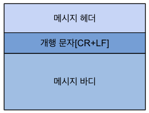
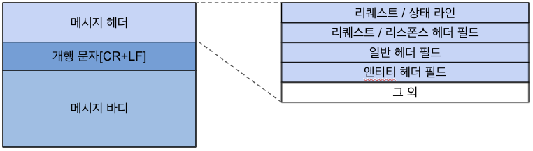

## HTTP 메세지

- HTTP에서 교환하는 정보

- 복수 행(개행 문자는 CR+LF)의 데이터로 구성된 텍스트 문자열

<br>



- 메시지 헤더

  - 서버와 클라이언트가 꼭 처리해야하는 리퀘스트와 리스폰스 내용과 속성

- CR+LF

  - CR(Carrage Return): 16진수 0x0d
  - LF(Line Feed): 16진수 0x0a

- 메시지 바디
  - 꼭 전송되는 데이터 그 자체

<br>

## 메시지 구조


[리퀘스트 메시지와 리스폰스 메시지 구조]

- 리퀘스트 라인

  - 리퀘스트에 사용하는 메소드
  - 리퀘스트 URI
  - 사용하는 HTTP 버전

- 상태 라인

  - 상태코드 및 설명
  - HTTP 버전

- 헤더 필드
  - 리퀘스트와 리스폰스의 여러 조건과 속성 등을 나타냄

<br>

## 인코딩(변환)

- 데이터를 인코딩하므로써 전송 효율을 높일 수 있다.

- 다량의 액세스를 효율 좋게 처리할 수 있다.

- 리소스는 보다 많이 소비하게 된다.

<br>

### 메시지 바디와 엔티티 바디의 차이

- 메세지(message)
  - 옥텟 시퀀스(8비트)를 단위로 구성하고 통신을 통해 전송
  - 메시지 바디는 엔티티 바디를 운반하는 역할
- 엔티티(entity)
  - 리퀘스트와 리스폰스의 페이로드(payload, 부가물)로 전송되는 정보
  - 엔티티 헤더 필드와 엔티티 바디로 구성

전송 코딩이 적용된 경우 엔티티 바디의 내용이 변화한다.

<br>

### 콘텐츠 코딩

- 엔티티에 적용하는 인코딩

- 엔티티 정보를 유지한 채 압축한다.

- 콘텐츠 코딩된 엔티티는 수신한 클라이언트 측에서 디코딩한다.

- 콘텐츠 코딩 종류
  - gzip(GNU zip)
  - compress(UNIX의 표준 압축)
  - deflate(zlib)
  - identity(인코딩 없음)

<br>

### 청크 전송 코딩

- 엔티티 바디를 분할하는 기능

- 동작 순서

  1. 엔티티 바디를 청크(덩어리)로 분해한다.

  2. 청크 사이즈를 16진수로 단락을 표시하고 엔티티 바디 끝에 "0(CR+LF)"를 기록해 둔다.

  3. 청크 전송 코딩된 엔티티 바디는 수신한 클라이언트 측에서 원래의 엔티티 바디로 디코딩한다.

<br>

## 멀티파트

- 여러 다른 종류의 데이터를 수용하는 방법

- 하나의 메시지 바디 내부에 엔티티를 여러 개 포함시켜 보낼 수 있다.

- 주로 이미지나 텍스트 파일 등을 업로드할 때 사용한다.

- mulitpart/form-data

  - Web 폼으로부터 파일 업로드에 사용

- mulitpart/byteranges

  - 상태 코드 206(Partial Content) 리스폰스 메시지가 복수 범위의 내용을 포함하는 때에 사용

- 멀티파트 사용시 Content-type 헤더 필드를 사용

- "boundary" 문자열을 사용 -> 멀티파트 각각의 엔티티 구분

  - "--"를 선두에 삽입 ex) "--AaB03x", "--THIS_STRING_SEPARATES"
  - 멀티파트의 마지막에는 문자열 마지막 부분에 "--"를 삽입 ex) "--AaB03x--", "--THIS_STRING_SEPARATES--"

- 파트마다 헤더 필드를 포함한다.

<br>

## 레인지 리퀘스트

- 범위를 지정하여 리퀘스트 하는 것

- Request body  
   `Range: bytes = 5001-10000`

- Response body

  ```
  Content-Range: bytes 5001-10000 / 10000
  Content-Length: 5000
  Content-Type: image / jpeg
  ```

- 바이트 레인지 형식

  - 5,001 ~ 10,000 바이트
    `Range: bytes = 5001-10000`
  - 5,001 바이트 이상
    `Range: bytes = 5001-`
  - 처음부터 3,000 바이트까지, 그리고 5,000~7,000 바이트까지의 복수 범위
    `Range: bytes =-3,000, 5000-7000`

- 상태 코드 206 Partial Content를 반환

- 서버가 레인지 리퀘스트 지원하지 않을 시 상태코드 200 OK로 완전 엔티티 반환

<br>

## 콘텐츠 네고시에이션

- 같은 콘텐츠(내용)이자만 여러 개의 페이지를 지닌 웹 페이지 구조

- 클라이언트 / 서버가 제공하는 리소스의 내용에 대해 교섭하는 것

- 클라이언트에 더욱 적합한 리소스를 제공하기 위한 구조

- 제공 리소스를 언어와 문자 세트, 인코딩 방식 등을 기준으로 판단

<br>

### 서버 구동형 네고시에이션(Server-driven Negotiation)

- 서버 측에서 콘텐츠 네고시에이션을 하는 방식

- 서버 측에서 리퀘스트 헤더 필드의 정보를 참고해서 자동적으로 처리

- 브라우저가 보내는 정보를 근거로 하기 때문에 유저가 원하는 정보가 아닐 수 있음

<br>

### 에이전트 구동형 네고시에이션(Agent-driven Negotiation)

- 클라이언트 측에서 콘텐츠 네고시에이션을 하는 방식

- 브라우저에 표시된 선택지 중 유저가 수동으로 선택

<br>

### 트랜스페어런트 네고시에이션(Transparent Negotiation)

- 서버 / 에이전트 구동형을 혼합한 것

- 서버와 클라이언트가 각각 콘텐츠 네고시에이션을 하는 방식
