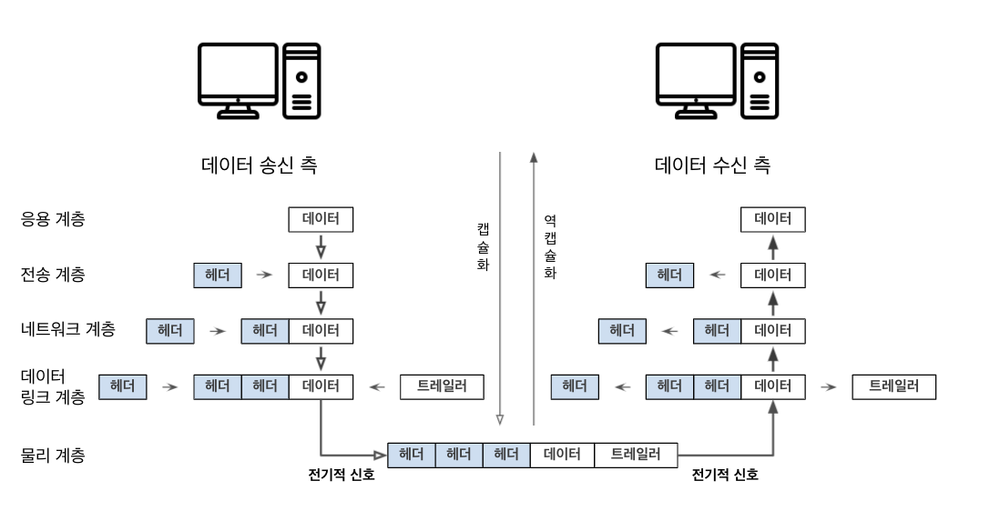

# 네트워크의 규칙

## 프로토콜

- 통신하기 위한 규칙을 프로토콜이라고 한다.

 

## OSI 모델과 TCP/IP 모델

### **OSI 모델**

- ISO(국제표준화기구)에서 정한 네트워크 기술의 표준 규격

- 7개의 계층(Layer)을 지님

- **응용 계층** (7 계층)
  - 애플리케이션에 대한 서비스를 제공
- **표현 계층** (6 계층)
  - 문자 코드, 압축, 암호화 등의 데이터를 변환
- **세션 계층** (5 계층)
  - 세션 체결, 통신 방식을 결정
- **전송 계층** (4 계층)
  - 선뢰할 수 있는 통신을 구현
- **네트워크 계층** (3 계층)
  - 다른 네트워크와 통신하기 위한 경로 설정 및 논리 주소 결정
- **데이터 링크 계층** (2 계층)
  - 네트워크 기기 간의 데이터 전송 및 물리 주소 결정
- **물리 계층** (1 계층)

  - 시스템 간의 물리적인 연결과 전기 신호를 변환 및 제어

- 데이터 흐름
  - 송신: 응용 계층 (7 계층) -> 물리 계층 (1 계층)으로 데이터를 전달한다.
  - 수신: 물리 계층 (1 계층) -> 응용 계층 (7 계층)으로 데이터를 전달한다.
  - 각 계층 독립적 -> 데이터 전달 동안 다른 계층의 영향 받지 않음

 

### **TCP/IP 모델**

- OSI 모델을 4계층으로 바꾼 모델

- **응용 계층** (4 계층)
  - 응용 계층
  - 표현 계층
  - 세션 계층
- **전송 계층** (3 계층)
- **인터넷 계층**(2 계층)
  - 네트워크 계층
- **네트워크 접속 계층** (1 계층)
  - 데이터 링크 계층
  - 물리 계층

 

## 캡슐화와 역캡슐화

### 캡슐화

- 데이터 전송시 데이터의 앞부분에 헤더를 붙여서 다음 계층에 보내는 것

- 헤더가 가지는 정보
  - 데이터의 앞부분에 전송하는 데 필요한 정보
  - 데이터를 전달받을 상대방에 대한 정보

 

### 역캡슐화

- 데이터 수신때 헤더를 제거하는 것

 

### 데이터 전송 흐름

1. 송신 측 **응용 계층**에서 웹 사이트를 접속하기 위한 요청 데이터 생성

2. 신뢰할 수 있는 통신을 위한 **전송 계층**의 헤더를 첨가

3. 다른 네트워크와의 통신을 위한 **네트워크 계층**의 헤더를 첨가

4. **데이터 링크 계층**에서 물리적인 통신 채널 연결을 위한 헤더와 트레일러를 첨가

   - 트레일러: 데이터를 전달할 때 데이터의 마지막에 추가하는 정보

5. **물리 계층**에서 **전기적 신호**로 전환 -> 수신 측 도달

6. 역캡슐화 진행
