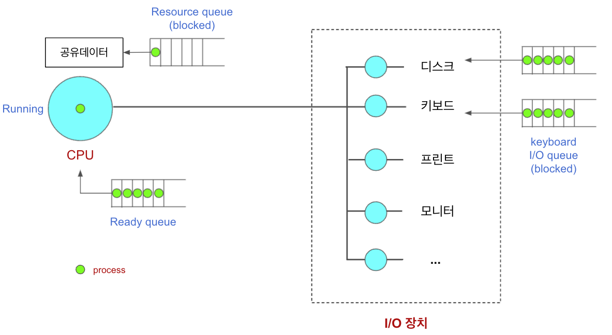
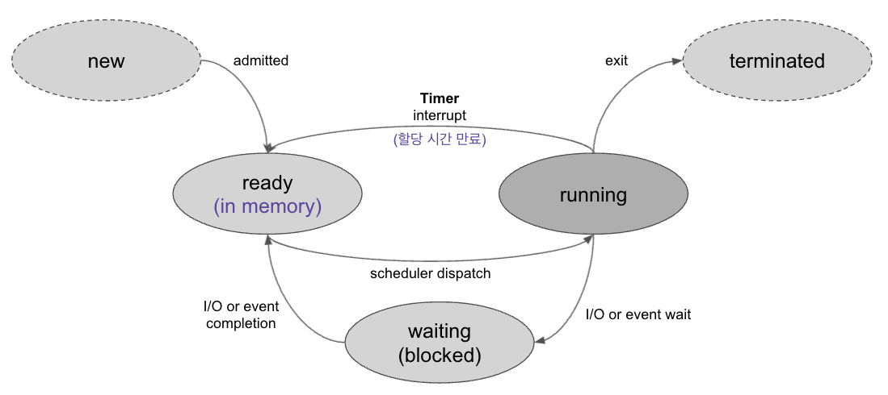
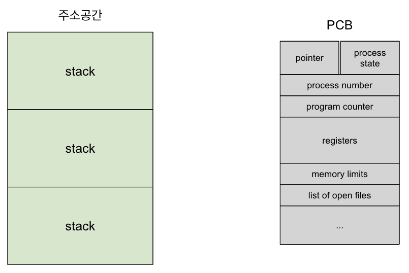
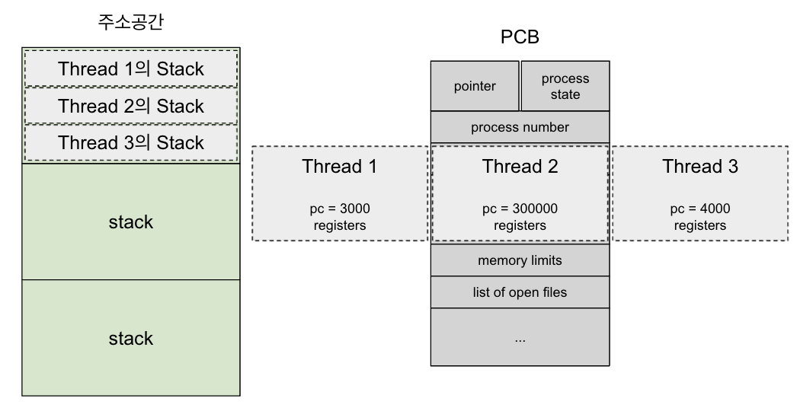

# Process

## 프로세스 개념

- 실행중인 프로그램

### 프로세스의 문맥(context)

- **현재 프로세스의 상태**

- CPU 수행 상태를 나타내는 하드웨어 문맥

  - Program Counter

  - 각종 regitster

- 프로세스의 주소 공간
  - PCB(Process Control Block)
    - 각 프로세스의 상태가 어떤 상탠지 일일이 관리
  - Kernel stack

## 프로세스의 상태

프로세스는 상태(state)가 변경되며 수행된다.

- **Running**

  - CPU를 잡고 instruction을 수행중인 상태

- **Ready**

  - CPU를 기다리는 상태(메모리 등 다른 조건을 모두 만족하고)

- **Blocked (wait, sleep)**

  - CPU를 주어도 당장 instruction을 수행할 수 없는 상태
  - Process 자신이 요청한 event(예: I/O)가 즉시 만족되지 않아 이를 기다리는 상태
    - ex) scanf에서 input을 기다리는 상태
  - ex) 디스크에서 file을 읽어와야 하는 경우
  - **자신이 요청한 event가 만족되면 Ready**

- **Suspended (stopped)**

  - 외부적인 이유로 프로세스의 수행이 정지된 상태
  - 프로세스는 통째로 디스크에 swap out된다.
  - ex) 사용자가 프로그램을 일시 정지시킨 경우(break key)
  - **외부에서 resume해 주어야 Active**

- New: 프로세스가 생성중인 상태

- Terminated: 수행(execution)이 끝난 상태

- 공유데이터
  - 프로세스들이 같이 쓰는 데이터
  - 프로세스가 공유데이터를 쓰고 있으면 다른 프로세스는 기다리고 있어야함.

 

## 프로세스 상태도

 

## Process Control Block (PCB)

- 운영체제가 각 프로세스를 관리하기 위해 프로세스당 유지하는 정보

- 다음의 구성 요소를 가진다. (구조체로 유지)

  1. OS가 관리상 사용하는 정보

     - Process state, Process ID

     - scheduling information, priority(CPU를 넘거주기 위한 우선순위 정보)

  2. CPU 수행 관련 하드웨어 값

     - Program counter, registers

  3. 메모리 관련

     - Code, data, stack의 위치 정보

  4. 파일 관련

     - Open file dscriptors ...

## 문맥 교환(Context Switch)

- CPU를 한 프로세스에서 다른 프로세스로 넘겨주는 과정

- CPU가 다른 프로세스에게 넘어갈 때 운영체제는 다음을 수행

  - CPU를 내어주는 프로세스의 상태를 그 프로세스의 PCB에 저장

  - CPU를 새롭게 얻는 프로세스의 상태를 PCB에서 읽어옴

- ex) cache memory flush 등으로 문맥교환시 그 부담이 큼

### System call이나 Interrupt 발생시 반드시 Context switch가 일어나는 것은 아님

1. 사용자 프로세스 A(user mode) --> system call 함수(kernel mode) --> 사용자 프로세스 A

- 문맥 교환 없이 user mode 복귀

2. 사용자 프로세스 A(user mode) --> system call 함수(kernel mode) --> 사용자 프로세스 B

- 사용자 프로세스 A가 처리되다가 사용자 프로세스 B로 넘어갔기 대문에 문맥교환 일어남

## 스케줄러(Scheduler)

### **Long-term scheduler (장기 스케줄러 or job scheduler)**

- 시작 프로세스 중 어떤 것들을 **ready queue**로 보낼지 결정 - 상태도에서 admitted를 해주는 부분

- 프로세스에 **memory(및 각종 지원)**을 주는 문제

- **degree of Multiprogramming**을 제어

- time sharing system에는 보통 장기 스케줄러가 없음(무조건 ready)

### **Short-term scheduler (단기 스케줄러 or CPU scheduler)**

- 어떤 프로세스를 다음번에 **running**시킬지 결정

- 프로세스에 **CPU**를 주는 문제

- 충분히 빨라야 함(millisecond 단위)

### **Medium-Term Scheduler (중기 스케줄러 or Swapper)**

- 여유 공간 마련을 위해 프로세스를 통째로 메모리에서 디스크로 쫓아냄

- 프로세스에게서 **memory**를 뺏는 문제

- **degree of Multiprogramming**을 제어
  - (메모리에 올라간 프로그램이 몇개냐)

 

## Thread(lightweight process)

- 동일한 프로그램을 여러개 띄우더라도 프로세스가 하나만 만들어짐

  - 대신 서로 다른 부분의 코드를 수행 -> Thread는 CPU 수행의 단위이다.
  - Program Counter 만 여러개 띄움

- context switch가 발생하지 않아 값비싼 오버헤드가 필요 없다.

- Thread 구성

  - program counter

  - register set

  - stack space

- Thread가 동료 thread와 공유하는 부분(=task)

  - code section
  - data section
  - OS resources

- 전통적인 개념의 heavyweight process는 하나의 thread를 가지고 있는 task로 볼 수 있다.

### Thread 장점

- 다중 스레드로 구성된 태스크 구조에서는 하나의 서버 스레드가 blocked(waiting) 상태인 동안에도  
  동일한 태스크 내의 다른 스레드가 실행(running)되어 빠른 처리를 할 수 있다.

- 동일한 일을 수행하는 다중 스레드가 협력하여 높은 처리율(throughput)과 성능 향상을 얻을 수 있다.

- 스레드를 사용하면 병렬성을 높일 수 있다.
