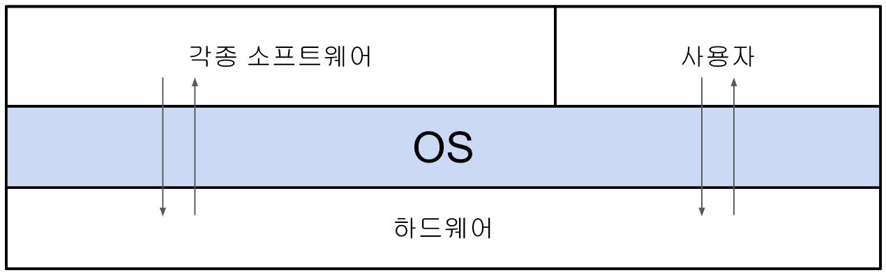
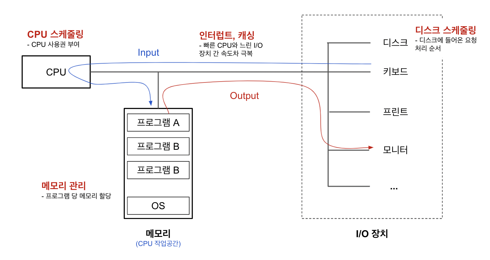
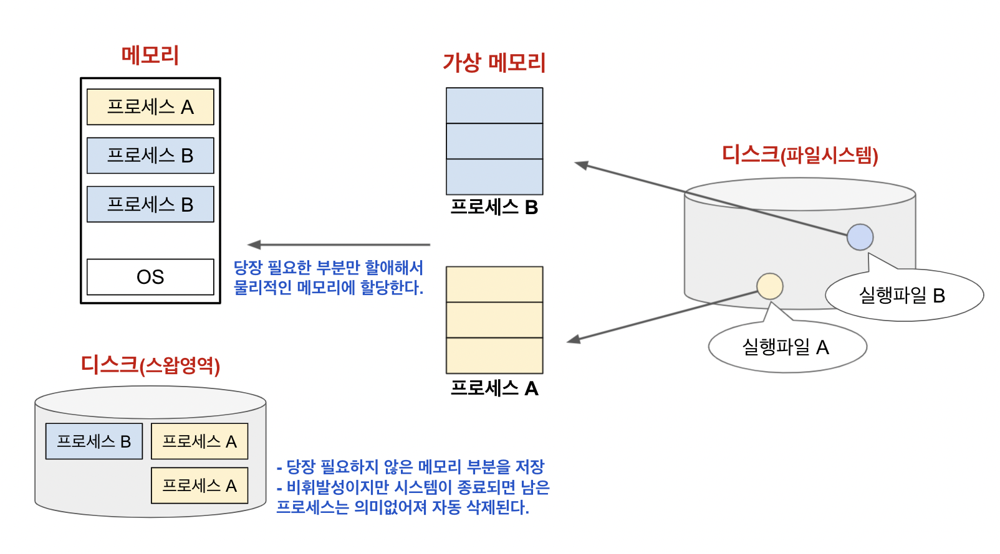
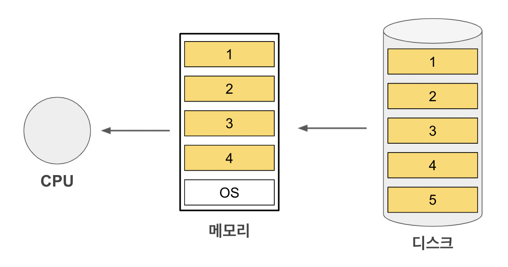
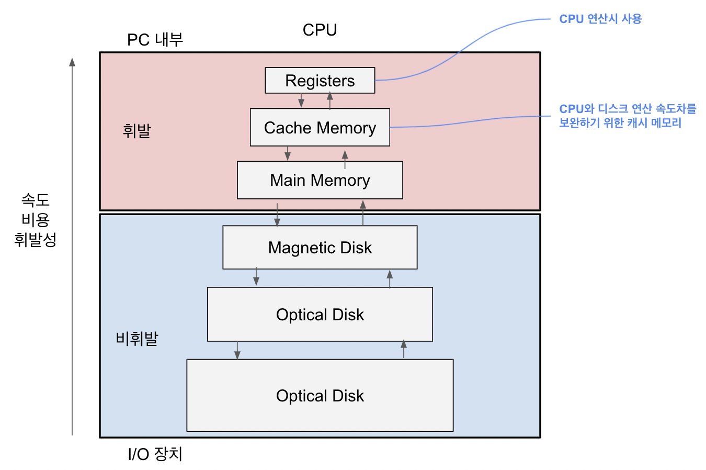

# 운영체제란?

- 하드웨어 바로 위 S/W 계층

- 다른 모든 S/W와 하드웨어를 연결

- 편리한 환경 제공

  - 프로그램들이 독자적으로 PC에서 실해되는 느낌을 부여

  - 하드웨어를 직접 다루는 복잡한 부분을 대행

- **자원의 효율적 관리**
  - CPU, Memory, I/O 장치 등의 효율적 관리
  - **효율성**  
    -> 주어진 자원의 최대 성능
  - **형평성**  
    -> 특정 프로그램의 지나친 불이익 방지

 

## **컴퓨터 내부 구조**

### **CPU 역할**

 

### **CPU 스케줄링**

---

- 여러 프로그램들이 CPU 큐에서 대기중일때 어떤 프로그램에 CPU를 할당시킬지 정함

- **FCFS(First Come First Served)**  
  P1 = 24  
  P2 = 4  
  P3 = 2  
  process 도착 순서: P1, P2, P3

  - Wait Time: P1 = 0, P2 = 24, P3 = 27
  - Average waiting time = (0 + 24 + 27)/3 = 17

- **SJF(Shortest Job First)**  
  **CPU 사용시간**이 **가장 짧은 프로세스**를 제일 먼저 스케줄  
  -> **최소 평균 대기시간**(Minimum Average Waiting Time) 보장  
  P1 = 24
  P2 = 4  
  P3 = 2  
  process 도착 순서: P3, P2, P1

  - Wait Time: P3 = 0, P2 = 2, P1 = 6
  - Average waiting time = (0 + 2 + 6)/3 = 2.33..

  ❗️issue : 기아현상(Starvation) -> 형평성 문제

- **Round Robin**

  - 각 process는 동일 크기의 CPU 할당 시간을 가짐

  - 할당 시간 끝 -> 인터럽트 -> CPU 빼앗김 -> 큐 제일 뒤에 줄섬

  - n개의 process가 CPU 큐에 있는 경우  
    -> 어떤 process도 **(n-1) \* 할당시간** 이상 기다리지 않음

 

### **메모리 관리**

---

- **LRU vs LFU**  
  CPU가 요청한 페이지 순서  
  1,1,1,1,2,2,3,3,2,4,5...

  

  5번 페이지를 보관하기 위해 삭제해야할 페이지는?

  - **LRU**(가장 오래전에 참조한 페이지 삭제): 1번
  - **LFU**(참조 횟수가 가장 적인 페이지 삭제): 4번

 

### **디스크 스케줄링**

---

### 디스크 접근 시간(Access Time)의 구성

- **탐색시간 (Seek Time)**
  - 헤드를 해당 트랙으로 움직이는데 걸리는 시간
- **회전 지연시간**
  - 헤드가 원하는 섹터에 도달하기까지 걸리는 시간
- **전송 시간**
  - 실제 데이터 전송 시간

 

### 디스크 스케줄링

- **FCFS(First Come First Served)**

  - Seek Time을 최소화하는 것이 목표
  - Seek Distance와 흡사

- **SSTF(Shortest Seek Time First)**

  - 시작점에서 탐색 시간이 가장 짧은 프로세스부터 처리
  - ❗️Issue: Starvation

- **SCAN**
  헤드가 한쪽 끝 -> 다른 한쪽 끝까지 이동 간 길목에 있는 모든 요청처리

 

### **저장 장치 계층 구조와 캐싱**

---

