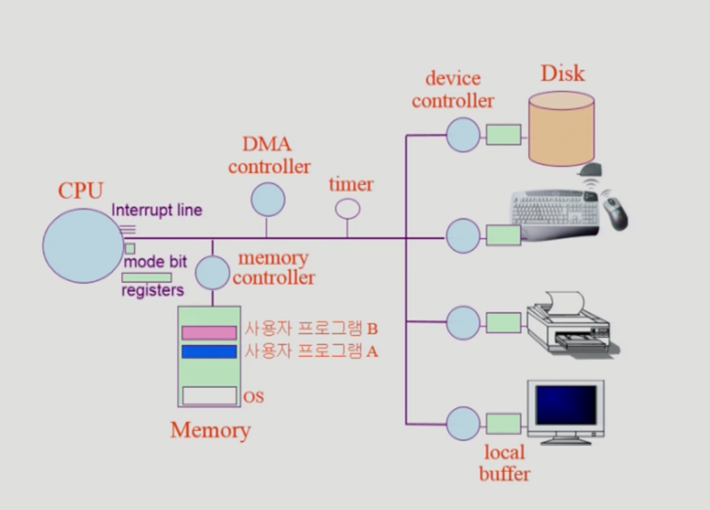

# 컴퓨터 시스템의 구조



## Mode bit

- 사용자 프로그램의 잘못된 수행으로 다른 프로그램 및 운영체제에  
  피해가 가지 않도록 하기 위한 보호 장치

```
1 사용자 모드: 사용자 프로그램 수행
0 모니터 모드: OS 코드 수행
```

- 특권명령: 보안을 해칠 수 있는 명령어는 모니터모드에서만 수행

- Interrupt나 Exception 발생시

  - H/W가 mode bit을 0으로 바꿈

- 사용자 프로그램에게 CPU 넘기기 전에 mode bit을 1로 셋팅

## Timer

- 정해진 시간이 지나면 OS에게 제어권이 넘어가도록 인터럽트 발생
- 매 클럭 틱 때마다 1씩 감소
- 타이머 값이 0이되면 인터럽트 발생
- CPU가 독점 프로그램에 독점되는 것을 방지
- Time sharing을 위해 이용됨
- 현자 시간을 계산하기 위해서

## Device Controller

- 해당 I/O 장치를 관리하는 작은 CPU
- Device Driver
  - CPU가 Device Controller에 명령을 줄때 사용되는 소프트웨어
- Firmware
  - Device Controller에서 CPU에서 받은 명령어를 수행하게 하는 소프트웨어

### 시스템콜 (System Call)

- 사용자 프로그램이 OS의 서비스를 받기 위해 커널 함수를 호출하는 것

- 각 I/O 장치들에게 CPU가 요청하는 명령어들은 특권 명령이다.  
   -> 프로그램이 CPU를 통해 I/O 장치에 접근하기 위해선 OS 의 도움이 필요하다.
- CPU가 개별 프로그램에서 OS로 넘어가는 방법 - **인터럽트**
  - 개별 프로그램 내부에 인터럽트 발생 코드를 작성하여 CPU 가 확인하고 OS를 호출한다.

### 인터럽트 (Interrupt)

- 현대의 운영체제는 인터럽트에 의해 구동된다.

- 인터럽트 당한 시점의 레지스터와 program counter를 save한 후 CPU의 제어를 인터럽트 처리 루틴에 넘긴다.

- Interrupt (넓은 의미)

  - Interrupt (H/W interrupt): 하드웨어가 발생시킨 인터럽트
  - Trap (S/W Interrupt)
    - Exception: 프로그램이 오류를 법한 경우
    - System call: 프로그램이 커널 함수를 호출하는 경우

- 인터럽트 관련 용어
  - 인터럽트 벡터  
    해당 인터럽트의 처리 루틴 주소를 가지고 있음.
  - 인터럽트 처리 루틴 (인터럽트 핸들러)  
    해당 인터럽트를 처리하는 커널 함수

## 동기식 입출력과 비동기식 입출력

### 동기식 입출력(synchronous I/O)

- I/O 요청 후 입출력 작업이 완료된 후에야 제어가 사용자 프로그램에 넘어간다.

- 구현 방법 1

  - I/O가 끝날 때까지 CPU를 낭비시킴
  - 매시점 하나의 I/O만 일어남

- 구현 방법 2
  1. I/O가 완료될 때까지 해당 프로그램에게서 CPU를 빼앗음
  2. I/O 처리를 기다리는 줄에 그 프로그램을 줄 세움
  3. 다른 프로그램에게 CPU를 줌

### 비동기식 입출력(asynchronous I/O)

- I/O가 시작된 후 입출력 작업이 끝나기를 기다리지 않고 제어가 사용자 프로그램에 즉시 넘어감.

## DMA (Dircet Memory Access)

- I/O가 끝날때마다 매번 인터럽트를 발생시킨다면 그 또한 CPU 낭비일 수 있다.

- 메모리는 CPU만 접근이 가능한데 이를 I/O 장치가 직접 접근할 수 있게 하는 장치

- 빠른 입출력 장치를 메모리에 가까운 속도로 처리하기 위해 사용

- byte 단위가 아니라 block 단위로 인터럽트를 발생시킨다.
