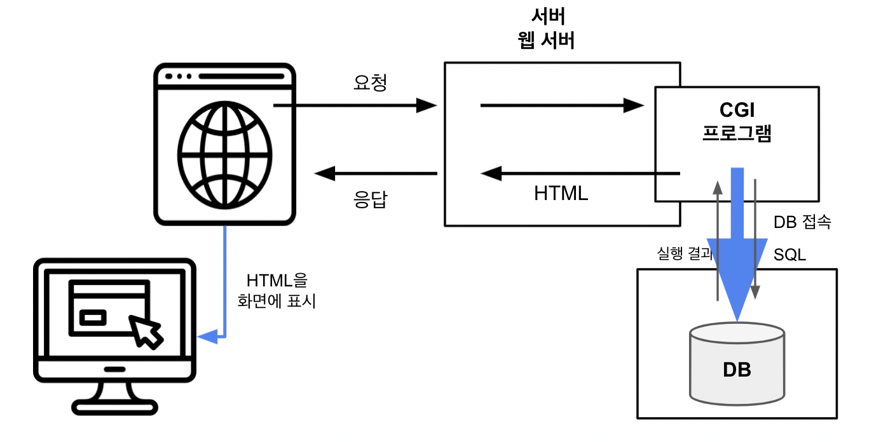

# 데이터베이스

### **데이터**

- 컴퓨터 안에 기록되어 있는 숫자

 

### **데이터베이스**

- 데이터의 집합

- 컴퓨터 안에 기록된 모든 것

- 특정 데이터를 확인하고 싶을 때 간단하게 찾도록 정리된 형태

- 데이터의 영구적 보존을 위해 주기억장치가 아닌 HDD/SSD 등 비휘발성 저장장치에 저장

 

## **DB와 DBMS**

- **DB(Database)**:

  - 저장장치 내 정리되어 저장된 데이터 집합

- **DBMS(Database Management System)**:
  - 데이터베이스를 효율적으로 관리하는 소프트웨어

 

### **DBMS의 필요성**

- **생산성**
  - 데이터 검색, 추가, 삭제, 갱신 등의 기본 기능을 제공  
    -> 효율성 증대
- **기능성**

  - 대용량 데이터를 고속으로 검색하거나 유저의 기능 확장성 등을 보장

- **신뢰성**

  - 여러 요청에 대응할 수 있도록 만들어짐

  - 클러스터 구성 | 스케일 아웃
    - 확장성과 부하 분산을 구현할 수 있음.

 

### **SQL**

- RDBMS를 조작하는 언어

- 종류

  - DML: 기본적인 데이터 조작시 사용

  - DDL: DB Object를 만들거나 삭제하는 명령어
  - DCL: 트랙잭션 제어

 

# 데이터베이스 서버

## **클라이언트/서버 모델**

### **웹 시스템에서의 클라이언트/서버**

- 웹 시스템: 브라우저와 웹 서버로 구성되는 클라/서버 모델의 시스텀

  - 브라우저(클라이언트)는 특정 URL과 연결된 웹 서버에 요청(Request)을 보냄

  - 서버는 요청에 대한 응답(Response)을 반환

 

### **RDBMS의 클라이언트/서버**

- 웹 시스템 + **사용자 인증**
  - 사용자 별 접근 제한

## **웹 애플리케이션의 구조**

- CGI(Common Gateway Interface)

  - 동적 콘텐츠를 위한 확장 방식

  - 프로그램(ex.DBMS)과 웹 서버 간을 연동, 통신
  - 데이터베이스의 클라이언트 역할

- 웹 서버와 DB를 서로 다른 머신에 구성
  - 처리 분산 -> 시스템 성능 향상

## **MySQL 서버와 mysql 클라이언트**

- 루프 백 접속

  - PC 한 대로 클라/서버 모두 실행시 사용된다.

  - 클라에서 request를 전송할 시 **네트워크를 경유**해서 PC에 되돌아 온다.
